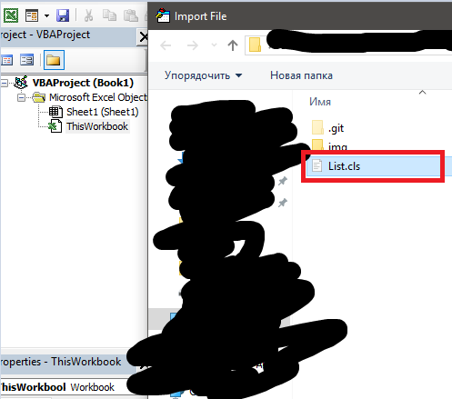

# VBA-List
VBA class that represents a list of elements that can be accessed by index. Provides methods to search, sort, and manipulate lists.

## Installation

You should import the `List.cls` file to your project. 

| Step 1               | Step 2               |
|----------------------|----------------------|
|  |  |

## Details

### Compatibility with collections

The list is compatible with standard `VBA.Collection` class, with one exception: it is possible to use only `Integer`, `Long` etc numbers as indexes. It is also impossible to use `List` as hash-table, so there's no `Key` argument in `Add` method. 

### Set item by index

Standard `VBA.Collection` does not allow you to change element by index. 

```VB.net
Dim coll As VBA.Collection
Set coll = New VBA.Collection

coll.Add 1
coll.Add 2

Let coll(1) = 3 ' Exception
```

In `List` you are able to do this with `SetElement` method

```VB.net
Dim coll As List
Set coll = New List

coll.Add 1
coll.Add 2

coll.SetElement Index:=1, Value:=3
```

### Output 

`List` contains the `ToString` method allowing to represent the `List` as string, for example to output it via `Debug.Print` function

```VB.net
Dim coll As List
Set coll = New List

coll.Add 1
coll.Add 2

Debug.Print coll.ToString()
```

### Methods allowing to get sub-lists

```VB.net
Dim coll As List
Set coll = New List

coll.Add 1
coll.Add 2
coll.Add 3
coll.Add 4

Debug.Print coll.Left(2).ToString() ' 1 2
Debug.Print coll.Right(2).ToString() ' 3 4
Debug.Print coll.Mid(2, 2).ToString() ' 2 3
```

### Checking for the existance of the element

The method `Contains` returns `True` is case of existance of an argument in the list, otherwise `False`. The method `IndexOf` returns index of index of first occurence of the element in the list. `CountOf` returns amount of occurences of the argument in the list. 

```VB.net
Dim coll As List
Set coll = New List

coll.Add 1
coll.Add 2
coll.Add 3
coll.Add 4
coll.Add 3

Debug.Print coll.Contains(2) ' True
Debug.Print coll.Contains(5) ' False

Debug.Print coll.IndexOf(2) ' 2
Debug.Print coll.IndexOf(5) ' 0

Debug.Print coll.CountOf(3) ' 2
Debug.Print coll.CountOf(2) ' 1
```

### For each loop

You can easily use the "for each" loop as with the `VBA.Collection` class.

```VB.net
Dim coll As List
Dim elem As Variant
Set coll = New List

coll.Add 1
coll.Add 2
coll.Add 3

For Each elem In coll
    Debug.Print elem
Next elem
```

### Adding the elements

There are a lot of methods of adding the elements. You can add element by itself with `Add` method, an array with `AddArray` method, `Excel.Range` with `AddRange` method etc

```VB.net
Dim arr() As String
Dim lst As List
Dim c As Collection

...

Dim coll As List
Set coll = new List
coll.Add 1
coll.AddArray arr
coll.AddList lst
coll.AddCollection c
```

### Sorting

It is possible to sort elements with `Sort` method. You can also use `SortDescending` to sort in descending order, `SortAlphabetically` to force sorting elements in alphabetical order (all elements casts to string), `SortNumbers` to force sorting numeric values (elements that impossible to cast to numbers will be ignored). 

```VB.net
Dim lst As List
Set lst = New List

lst.Add 1
lst.Add 4
lst.Add 3
lst.Add -2

Dim sortedLst As List
Set sortedLst = lst.Sort()
```

### Mapping, filtering... 

You can use `List` to use operators like `Map`, `Filter`, `Sort` (by your predicate). 

```VB.net
Public Sub Process()
    Dim lst As List
    Set lst = New List
    
    lst.Add 1
    lst.Add 4
    lst.Add 3
    lst.Add -2
    
    Dim processedLst As List
    Set processedLst = lst _
        .Sort(Predicate:="Module1.Lambda_Compare_Abs") _
        .Map(Predicate:="Module1.Lambda_Map_Sqr") _
        .Filter(Predicate:="Module1.Lambda_Filter_More_Then_1")
        
    Debug.Print lst.ToString()
End Sub

''' comparer returns:
'''  > 0 => x > y
'''  = 0 => x = y
'''  < 0 => x < y>
Private Function Lambda_Compare_Abs(ByVal x, ByVal y)
    Lambda_Compare_Abs = Abs(x) - Abs(y)
End Function

Private Function Lambda_Map_Sqr(ByVal x)
    Lambda_Sqr = x * x
End Function

Private Function Lambda_Filter_More_Then_1(ByVal x)
    Lambda_Filter_More_Then_1 = x > 1
End Function
```

### Preprocessor properties

1. `UseExcelObjects` - if `True`, you will have an access to methods that manipulate with MS Excel objects, for example method `AddRange`. 
2. `UseDictionaryWin` (Windows) and `UseDictionaryMac` (Mac) - if `True`, list will have some optimizations and an access to `GroupBy` method. Will be working correctly only if the project will have an access to `Dictionary` class. To to this, you may add reference to `Scripting.Dictionary` (Windows only) or import the [`VBA-Dictionary`](https://github.com/VBA-tools/VBA-Dictionary) class in your project (you can to this in Windows or Mac). 
3. `MinIndex` - number of the first index. The most common values are `0` (C way) or `1` (Pascal way, also compatible with `VBA.Collection`). 

## License 

VBA-List is a free software. You can run, modify and redistribute it under [MIT License](LICENSE).